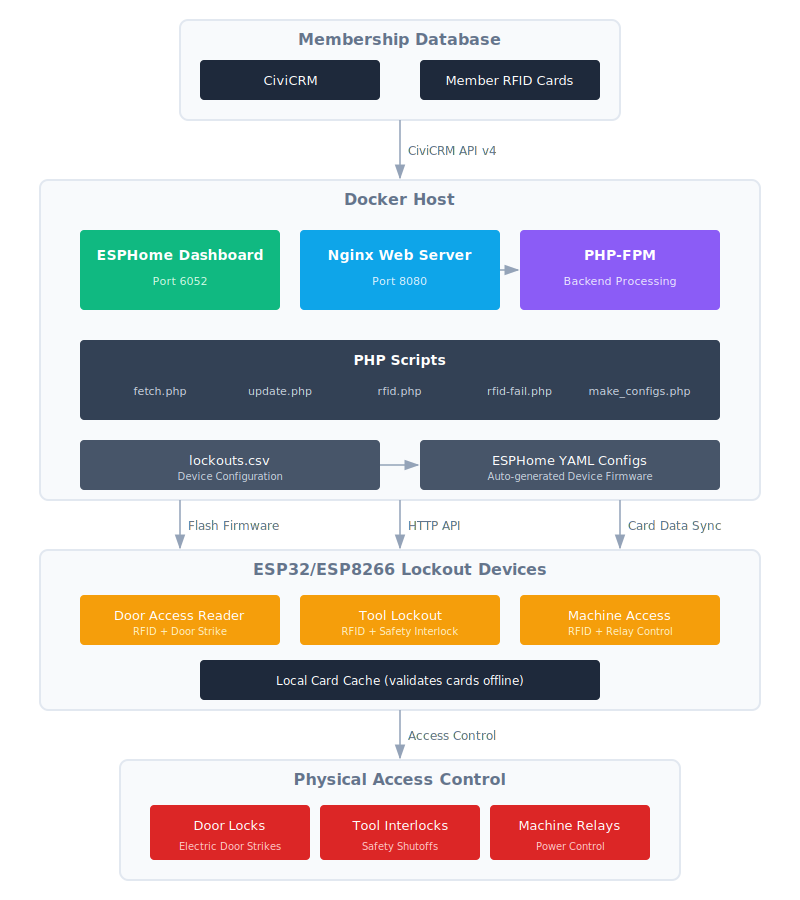

# AR Lockout Project version 4

This is a set of docker containers and php scripts to manage building and tool lockouts for ArchReactor makerspace.

## System Architecture

This diagram illustrates the flow of membership data from CiviCRM through to physical access control devices.

<picture>
  <source media="(prefers-color-scheme: dark)" srcset="./Assets/architecture_dark.svg">
  
</picture>

### Flow Description

1. **Membership Database**: Member RFID card data is stored in CiviCRM along with group/permission assignments.
2. **Docker Host**: PHP scripts pull card data from the CiviCRM API v4, while ESPHome manages device firmware and configuration.
3. **Configuration Generation**: The `lockouts.csv` file defines each physical device, and `make_configs.php` generates ESPHome YAML configs.
4. **ESP Devices**: ESP32/ESP8266 microcontrollers cache card lists locally for offline validation and control physical access hardware.
5. **Physical Access**: Devices control door strikes, tool interlocks, and machine relays based on RFID card validation.

# Configuration

Multiple templated files need edited before running the containers

## Environment
Copy `env.template` to `.env` and edit as follows, all are required
 - UID: user ID number to run as, match the host user ID to simplify file permissions
 - TIMEZONE: Timezone for default date/time operations 
 - CIVICRM_AUTH: On your CIVICrm user profile page find the API Key tab and create/copy the Key value
 - CIVICRM_KEY: On the same tab find the Site Key value
 - CIVICRM_WEBSITE: your base website URL.
 - CIVICRM_APIv4URI: Path the civicrm APIv4, typically /civicrm/ajax/api4
 - CIVICRM_RFID_ACTVITY: ID of the RFID activity
 - CIVICRM_RFID_OWNER: Owner UID for logging fails, typically the same user the Auth key
 - ESPHOME_USER=a username for http auto on the esphome dashboard and devices
 - ESPHOME_PASSWORD=a password for the above

## Lockouts
In the `web` folder copy `lockouts.csv.template` to `lockouts.csv` and edit.  This CSV file has no column titles, so remove the last line of the template.  Enter all your lockout devices, one per line using the examples.

## ESPHome 'secrets'
in the `config` folder, copy `secrets.yaml.template` to `secrets.yaml` and edit the values.  For the API key, you may generate a key at https://esphome.io/components/api/

## Web restrictions and reverse proxy (optional)
2 optional config files exist for the nginx web server in the `nginx` folder.  

### Reverse proxy
If using a reverse proxy, copy `revproxy.conf.template` to `revproxy.conf` and edit the IP address to match the proxy on your LAN.

### Access restrictions
To limit what devices and access the php scrips (there is not authentication), copy the `allowdeny.conf.template` to `allowdeny.conf` and edit and add `allow` lines as needed.

# Start the containers

Simply run `docker compose up -d` to start the containers.  If there are issues, leave off the -d to look for errors in the output.

Connect to the ESPHome Dashboard at http://yourIP:6052/ and test the web server at http://yourIP:8080/.  

**NOTE**: ESPHome Dashboard will not be able to install using the "Plug into this computer" option unless you use localhost or configure an https reverse proxy.

# Generating YAML files

On the host, run the `./make_configs.sh` script, or run `docker compose run --rm php-cli`.  This will read the `web/lockouts.csv` and generate a YAML file in `config/` for each lockout.  If a file with same name exists a `.bak` copy will be made, only 1 backup copy will be kept of each file.

You may add other YAML files in the config folder for any other ESPHome devices that aren't lockouts, just be sure you aren't duplicating names.

Use the Dashboard to flash them.  Flashing is rare, only needed when new code versions are deployed or new devices are added.  on first boot the devices will fetch an initial card list.

# Updating the card data
http://yourIP:8080/update.php will instruct the devices found in `lockouts.csv` to fetch a new card list.

# Troubleshooting
Each generated device has a web server enabled, protected with the user and password you specified in the .env file.  This will show the device logs and state.  The device will log card reads and card matching results.

# Additional Documentation
- [DATA_DICTIONARY.md](./DATA_DICTIONARY.md) - Detailed documentation of configuration fields, environment variables, and CiviCRM integration.

